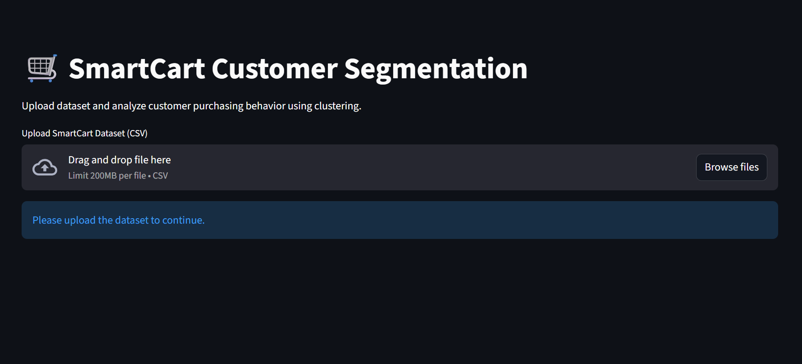
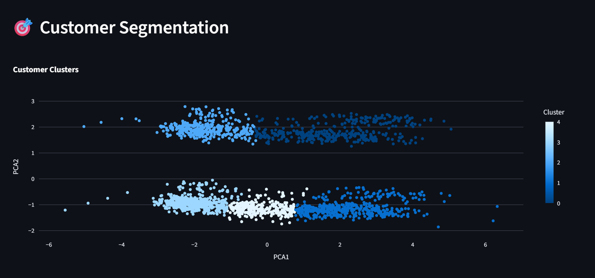

# SmartCart Customer Segmentation using Machine Learning

A machine learning-based customer segmentation project that analyzes customer purchasing behavior and groups customers into distinct segments using clustering techniques. The project includes data preprocessing, feature engineering, exploratory data analysis (EDA), dimensionality reduction, and customer segmentation visualization through a Streamlit web application.

---

## Overview

This project demonstrates an end-to-end machine learning workflow for customer segmentation using shopping behavior data.

The objective is to identify customer groups based on purchasing behavior, spending patterns, and demographic information to help businesses improve targeted marketing strategies.

---

## Objective

The primary objectives of this project are:

- Clean and preprocess customer shopping data
- Perform feature engineering for meaningful insights
- Analyze customer purchasing behavior
- Segment customers into meaningful groups using clustering
- Visualize customer segments interactively
- Build a web application using Streamlit

---

## Project Workflow

1. Data Collection  
2. Data Cleaning & Preprocessing  
3. Feature Engineering  
4. Exploratory Data Analysis (EDA)  
5. Data Scaling  
6. PCA (Dimensionality Reduction)  
7. Customer Segmentation using Clustering  
8. Cluster Analysis & Visualization  
9. Deployment using Streamlit

---

## Clustering Models Used

The following clustering algorithms were implemented and compared:

### K-Means Clustering
Used for partitioning customers into clusters based on similar purchasing behavior.

### Agglomerative Clustering
Used for hierarchical customer segmentation.

Both models produced similar segmentation patterns, and Agglomerative Clustering was selected for final cluster assignment.

---

## Features Engineered

The following additional features were created:

### Age
Derived using:

```python
Age = 2026 - Year_Birth
```

### Customer Tenure
Calculated using customer enrollment date.

### Total Spending
Created by combining product spending columns:

- Fruits
- Meat Products
- Fish Products
- Wines
- Sweet Products
- Gold Products

### Children
Combined from:

- Kidhome
- Teenhome

---

## Dataset Information

The dataset contains customer demographic and purchasing behavior information, including:

- Income
- Education
- Marital Status
- Recency
- Number of Web Purchases
- Number of Catalog Purchases
- Number of Store Purchases
- Product Spending Data
- Customer Enrollment Information

The dataset is included in this repository:

```txt
smartcart_customers.csv
```

---

## Tech Stack

### Programming Language
- Python

### Libraries & Frameworks
- pandas
- numpy
- matplotlib
- seaborn
- plotly
- scikit-learn
- Streamlit

### Development Environment
- Jupyter Notebook

---

## Project Structure

```txt
SmartCart-Customer-Segmentation/
│── SmartCart.ipynb
│── app.py
│── smartcart_customers.csv
│── requirements.txt
│── README.md
```

---

## Application Features

The Streamlit application includes:

- Dataset Upload
- Dashboard Overview
- Exploratory Data Analysis
- Income & Spending Visualization
- PCA-based Cluster Visualization
- Customer Cluster Summary

---

## Cluster Insights

The customers were segmented into **5 different groups** based on purchasing behavior and spending patterns.

Example customer groups include:

- High Income, High Spenders
- Moderate Income, Moderate Spenders
- Low Income, Low Spenders

These insights can help businesses design targeted marketing campaigns and improve customer engagement.

---

## Application Preview

### Dashboard


### Customer Segmentation


---

## Live Demo

Streamlit App: https://the-kr-abhishek-smartcart-customer-segmentation-app-avy7uu.streamlit.app/

---

## How to Run the Project

### 1. Clone Repository

```bash
git clone https://github.com/the-kr-abhishek/smartcart-customer-segmentation.git
cd smartcart-customer-segmentation
```

### 2. Install Dependencies

```bash
pip install -r requirements.txt
```

### 3. Run Streamlit App

```bash
streamlit run app.py
```

### 4. Run Jupyter Notebook

Open `SmartCart.ipynb` in Jupyter Notebook and run all cells.

---

## Limitations

- The project is optimized for the provided dataset structure.
- Different dataset schemas may require preprocessing changes.
- Cluster interpretation may vary depending on data distribution.

---

## Future Improvements

Planned enhancements:

- More clustering algorithms
- Better cluster comparison visualizations
- Dynamic parameter tuning
- Improved dashboard UI
- Customer segment prediction system

---

## Author

**Kumar Abhishek**
